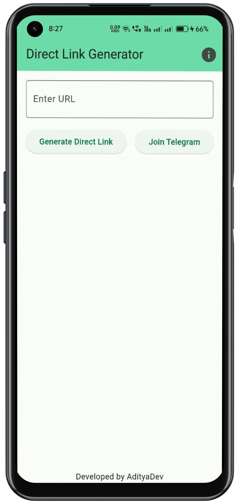
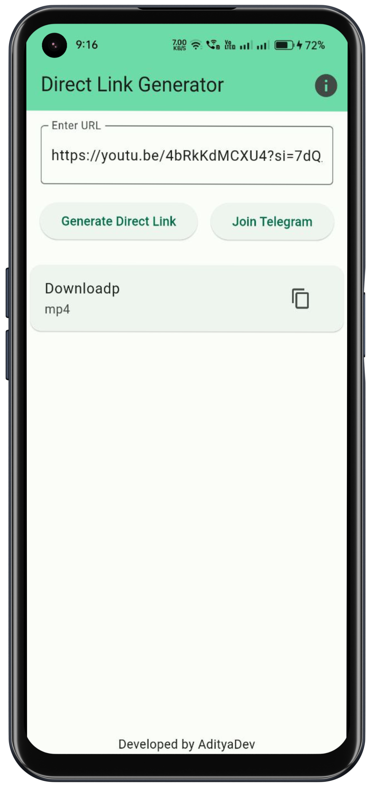

# DirectGen

DirectGen app extracts direct links from URLs, allowing you to stream and download content directly. Simply copy the generated URL and paste it in your browser for seamless access.

## Support Websites

- Facebook
- Instagram
- Youtube
- Twitter
- Dailymotion
- Vimeo
- VK
- SoundCloud
- Tiktok
- Reddit
- Threads

## Screenshots
<table>
<tr>
    <td></td>
    <td></td>
</tr>
</table>

## Installation
DirectGen can be installed using the following methods:

1. [Setup Flutter](https://flutter.dev/docs/get-started/install)
2. Clone this repo
```sh
git clone https://github.com/VikramadityaDev/Direct-Downloader
```
3. run this command to fetch the dependencies
```sh
flutter pub get
```
4. now build your APK using following command:
```sh
$ flutter build apk 
```

## Dependencies

The following packages are used as dependencies in this project:
- **direct_link:** ^0.2.2
- **url_launcher:** ^6.2.2
- **flutter_launcher_icons:** ^0.13.1

## Prerequisites

- Flutter SDK

## Contribution

Whether you have ideas, design changes, code cleaning, or real heavy code changes, help is always welcome. The more that is done, the better it gets! So feel free to create an issue and make a pull request 😊.

## License

```sh
MIT License

Copyright (c) 2023 Vikramaditya

Permission is hereby granted, free of charge, to any person obtaining a copy
of this software and associated documentation files (the "Software"), to deal
in the Software without restriction, including without limitation the rights
to use, copy, modify, merge, publish, distribute, sublicense, and/or sell
copies of the Software, and to permit persons to whom the Software is
furnished to do so, subject to the following conditions:

The above copyright notice and this permission notice shall be included in all
copies or substantial portions of the Software.

THE SOFTWARE IS PROVIDED "AS IS", WITHOUT WARRANTY OF ANY KIND, EXPRESS OR
IMPLIED, INCLUDING BUT NOT LIMITED TO THE WARRANTIES OF MERCHANTABILITY,
FITNESS FOR A PARTICULAR PURPOSE AND NONINFRINGEMENT. IN NO EVENT SHALL THE
AUTHORS OR COPYRIGHT HOLDERS BE LIABLE FOR ANY CLAIM, DAMAGES OR OTHER
LIABILITY, WHETHER IN AN ACTION OF CONTRACT, TORT OR OTHERWISE, ARISING FROM,
OUT OF OR IN CONNECTION WITH THE SOFTWARE OR THE USE OR OTHER DEALINGS IN THE
SOFTWARE.
```
